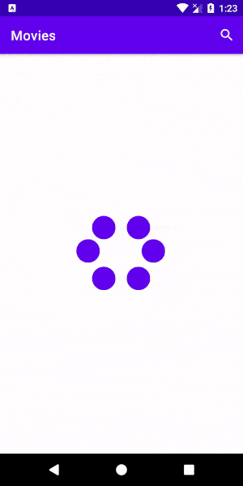
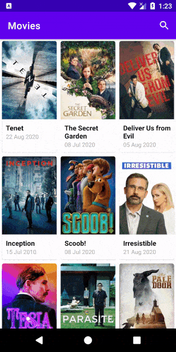
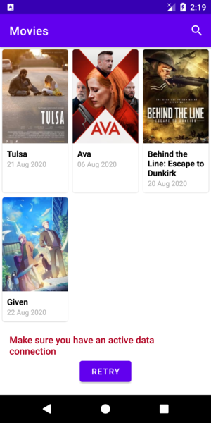
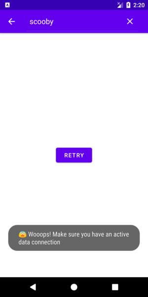

# Movies
A lite movie guide app, that lets you discover movies from TMDb.

## Features
* Provides an infinite scrolling list of movies in theatres from TMDb API
* Allows search on type for movies
* View movie details like poster, description, rating etc.

## Architecture
Application is built on top of MVVM model and Clean Architecture. The code is written in Kotlin. The goal is to present modern Android application architecture that is modular, scalable, maintainable and testable.

## Build
Take a look at config.gradle and fill it with your own API key like this:

```apiKey = YOUR_OWN_TMDB_API_KEY```

## Built With
* [Coroutines](https://developer.android.com/kotlin/coroutines) for concurrency
* [Hilt](https://dagger.dev/hilt/) for dependency injection
* [Paging 3](https://developer.android.com/topic/libraries/architecture/paging/v3-overview) for infinte scroll
* [Navigation Component](https://developer.android.com/guide/navigation) for navigating within the App
* [Retrofit](https://github.com/square/retrofit) for REST API communication
* [OkHttp](https://github.com/square/okhttp) for http & logging
* [Glide](https://github.com/bumptech/glide) for image loading
* [Moshi](https://github.com/square/moshi) for parsing JSON into Java objects
* [Lottie](https://airbnb.design/lottie/) for animations
* [Timber](https://github.com/JakeWharton/timber) for logging
* [MockK](https://github.com/mockk/mockk) for mocking inside the Unit Test

## Screens






